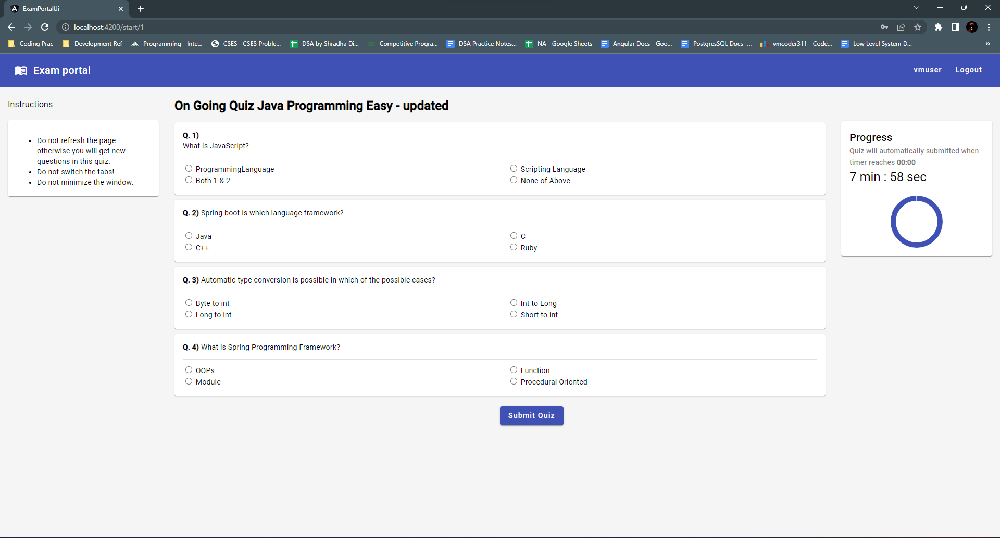

<div id="top"></div>

<!-- PROJECT LOGO -->
<br />
<div align="center">
  <h3 align="center">ExamPortal</h3>

  <p align="center">
    An Quiz Exam application for Charotar University of Science and Technology
    <br />
  </p>
</div>


<!-- TABLE OF CONTENTS -->
<details>
  <summary>Table of Contents</summary>
  <ol>
    <li>
      <a href="#about-the-project">About The Project</a>
      <ul>
        <li><a href="#built-with">Built With</a></li>
      </ul>
    </li>
    <li>
      <a href="#getting-started">Getting Started</a>
      <ul>
        <li><a href="#prerequisites">Prerequisites</a></li>
      </ul>
    </li>
    <li><a href="#problem">Problem statement</a></li>
    <li><a href="#features">Features</a></li>
    <li><a href="#screenshots">Screenshots</a></li>
  </ol>
</details>


<!-- ABOUT THE PROJECT -->
## About The Project

Exam Portal is a powerful, microservice-based web application that has been specifically designed to facilitate MCQ-based exams on web portals. It is an intuitive and easy-to-use platform that provides a range of features and tools that make it an excellent choice for educational institutions, particularly Charusat Engineering Department.

This application allows faculty members to add quizzes and MCQs to the platform, complete with custom options. This means that professors can create tailored quizzes that are specific to their course content and learning objectives. The application's user-friendly interface makes it easy to create and edit quizzes, and it provides a range of customization options to ensure that quizzes are engaging and challenging for students.

One of the most significant benefits of this application is its scalability. It has been developed to meet the needs of Charusat Engineering Department, which is used by 10 different departments and contains over 125 quizzes across more than 35 categories. This demonstrates the application's ability to handle a high volume of traffic and quizzes with ease.

In conclusion, the Exam Portal is a reliable, scalable, and secure platform for MCQ-based exams. It is an excellent tool for professors who want to create engaging quizzes that meet specific learning objectives, and for students who want a user-friendly and secure platform to take their exams.

<p align="right">(<a href="#top">back to top</a>)</p>


### Built With

The following technologies and tools have been equipped to develop this project -

* [Spring Boot]
* [Angular]
* [MySQL]
* [AWS S3]

<p align="right">(<a href="#top">back to top</a>)</p>


<!-- GETTING STARTED -->
## Getting Started

To get a local copy up and running follow these simple example steps.

### Prerequisites

* java - jdk 15 and above
* npm 
  ```sh
  npm install npm@latest -g
  ```
* node.js
* MySQL
* Run Angular Application with 
    ```
    ng serve
    ```
* Run Spring Boot application with 
    ```
    ./mvnw
    ```
<p align="right">(<a href="#top">back to top</a>)</p>


<!-- Problem statement -->
## Problem
Exam Portal is a user-friendly web-based application that allows professors to create custom quizzes and evaluate them easily. With this application, professors can create quizzes on specific categories and tailor them according to their preferences.

The application provides a range of customization options, such as the number of questions, marks for the quiz, and quiz status as active or inactive, giving complete control to the user. The platform is designed to cater to a wide range of academic requirements, and the quizzes created using this application are ideal for assessing student knowledge, understanding, and retention of concepts.

The interface of the Exam Portal is intuitive and easy to use, making it simple for professors to create quizzes without the need for technical expertise. Additionally, the application provides a variety of features to ensure that the quizzes created are of the highest quality, such as the ability to add multimedia content like images, videos, and audio to the questions.

With Exam Portal, professors can create quizzes that are engaging, challenging, and designed to meet specific learning objectives. The application is designed to facilitate the process of evaluating quizzes, providing professors with a comprehensive report on student performance, including details on each student's score, time taken, and response analysis.

Overall, Exam Portal is an excellent tool for professors to create and evaluate quizzes quickly and effectively, ensuring that students receive the best possible education and assessment experience.


<p align="right">(<a href="#top">back to top</a>)</p>


<!-- ROADMAP -->
## Features

* User friendly UI with easy navigations.
* Courses are divided into categories and sub-categories.
* An embedded video player to watch lectures in the browser itself.
* Allows faculties to attach quizzes and lecture materials for each video lecture.
* Each course goes through a thorough review process before it is available on the portal.
* Admin allocates a reviewer to each course and only after approval from the reviewer, course is available for students.

<p align="right">(<a href="#top">back to top</a>)</p>


<!-- CONTRIBUTING -->
## Screenshots
<p>
    <p>
        
    </p>
    <p>
        
    </p>
    <p>
        
    </p>
    <p>
        
    </p>
    <p>
        
    </p>
    <p>
        
    </p>
    <p>
        
    </p>
    <p>
        
    </p>
    <p>
        
    </p>
    <p>
        
    </p>
    <p>
        
    </p>
    <p>
        
    </p>
    <p>
        
    </p>
    <p>
        
    </p>
    <p>
        
    </p>
    <p>
        
    </p>
    <p>
        
    </p>
</p>
<p align="right">(<a href="#top">back to top</a>)</p>